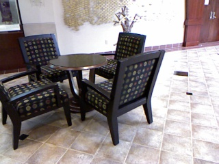
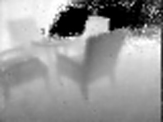

# Single Image Depth Estimation Using a Multi-scale Convolutional Neural Network

## Dependencies

- python 3.5
- opencv 3+
- tensorflow (both gpu and cpu version could work, but we strongly recommend you to use the GPU version to speed up the training process)
- Matplotlib (required in some python files including show_loss.py)

## Problem description

We aim to solve the problem of estimating depth information from single images.

We tested our networks on both Kinect style data and correlating RGB image and Lidar data.

## Dataset

[NYU V2 Depth dataset] https://cs.nyu.edu/~silberman/datasets/nyu_depth_v2.html

[Dataset Provided by Matt. From the course EECS599 Autonomous Driving Cars] http://umich.edu/~fcav/rob599_dataset_deploy.zip

See the file rawDataLoader.py and rgblDataLoader.py to figure out the proper directory to place the datasets.

## Training and Testing

Run training*.py to train the model.

For model with pre-train steps, run training*1.py and training*2.py sequentially.

Run show_loss.py to see the loss over training set and test set along the training process:

- python show_loss.py MODEL_NAME

To test the model, run test*.py. This will generate examples of predictions from the test set and write the images into /result_images directory.

Run evaluate.py to calculate the Absolute Relative Error, Root Mean Square Error etc. from the generated images:

- python evaluate.py MODEL_NAME ERROR_NAME

## Example of our dataset and predicted results
Origin RGB image:

Origin raw Depth file:

Predicted Depth:

